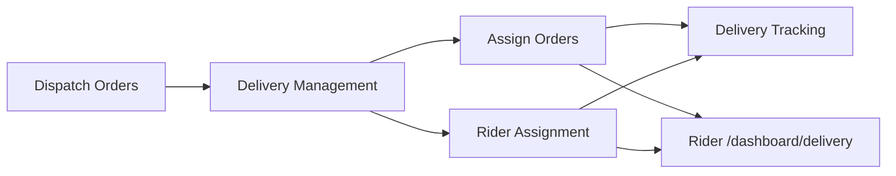

# Warehouse Internal Delivery Flow

Use this note when continuing delivery management, team assignment, tracking, or rider execution work.

## End-to-end flow (target)

```text
Dispatch Orders (fulfillment_mode = delivery)
  -> Delivery Management (select internal delivery, create/add to group)
  -> Assign Orders (group-centric: assign rider to batch)
  -> Rider Assignment (rider-centric: workload + assign pending group to idle rider)
  -> Delivery Tracking (warehouse monitors assigned/on-route groups)
  -> Rider dashboard (/dashboard/delivery): startDelivery -> markDelivered
  -> Settlement / group completion (later phase)
```



---

## Built vs not built

| Step | Route | Status | Notes |
|------|-------|--------|-------|
| Delivery Management | `/warehouse/dashboard/delivery-management` | **Done** | KPIs, invoice table, type selection, internal groups, optional rider at create |
| Assign Orders | `/warehouse/dashboard/delivery-team/assignments` | **Done** | Group list, KPIs, filters, group drawer, assign rider modal |
| Rider Assignment | `/warehouse/dashboard/delivery-team/assignment` | **Done** | Rider workload, idle/active, assign pending group to rider |
| Delivery Team CRUD | `/warehouse/dashboard/delivery-team` | **Done** | Redesigned to match desk pattern; create/ban/delete/reset password |
| Delivery Tracking | `/warehouse/dashboard/delivery-tracking` | **Stub** | Raw `fetch`; rebuild planned |
| Rider delivery dashboard | Delivery subdomain `/dashboard` | **Active** | Canonical owner-scoped portal for warehouse and retailer riders |
| Legacy rider mobile UI | `/deliveryman/dashboard` | **Redirect** | Redirects to the canonical delivery subdomain; four deferred child routes remain direct-access only |
| Settlement / OTP / complete group on warehouse UI | — | **Not built** | Belongs to tracking/settlement phase |
| Third-party delivery in DM | — | **Stubbed** | Internal delivery only in v1 |

---

## Two warehouse lenses (same data)

| | Assign Orders | Rider Assignment |
|--|---------------|------------------|
| **Route** | `/delivery-team/assignments` | `/delivery-team/assignment` |
| **Row** | Delivery **group** | Delivery **rider** |
| **Question** | Which groups need a rider? | Who is busy / idle? |
| **KPIs** | Total Groups, Pending, Assigned, Completed | Total Riders, Riders Assigned, Unassigned Groups |
| **Main action** | Assign **rider → group** | **Assign** pending **group → idle rider** |
| **Detail panel** | Group summary + invoices | Rider summary + active group orders |

**Unassigned Groups** on Rider Assignment = `pending_assignment` groups (same count as Assign Orders “Pending Assignment”).

Do **not** duplicate group management on the rider page. Do **not** assign individual orders to riders outside groups.

---

## Group and invoice status

### `delivery_group.status`

| DB value | Warehouse KPI bucket | UI label |
|----------|----------------------|----------|
| `pending_assignment` | Pending | Pending |
| `assigned` | Assigned | Assigned |
| `out_for_delivery` | Assigned | On route |
| `completed` | Completed | Completed |
| `partial` | Completed | Partial |

Migration [`0013_delivery_group_optional_rider.sql`](../packages/db/src/migrations/0013_delivery_group_optional_rider.sql): nullable `deliveryman_id`, `pending_assignment` status.

### Active rider workload

A rider is **active** when they have a group in `assigned`, `out_for_delivery`, or `partial`. **Active Orders** on Rider Assignment = `completedInvoices/totalInvoices` within that **one** group (not multiple groups).

---

## Post-assignment handoff (rider side)

Assignment is **data-only** from the warehouse UI. No redirect or notification is sent to the rider.

On `assignDeliveryman` ([`packages/api/src/routers/deliveryman.ts`](../packages/api/src/routers/deliveryman.ts)):

1. `delivery_group` → `deliverymanId`, `status = assigned`
2. Group `invoice` rows → `deliverymanId`
3. Linked `order` rows → `riderName`, `riderPhone`

Riders see work via `GET /my-deliveries` (`deliveryman.getMyGroups`) on:

- **Primary:** delivery subdomain `/dashboard` (login redirect for every `deliveryman` role)
- **Legacy entry:** `/deliveryman/dashboard` redirects to the primary portal

Warehouse staff use **`warehouse.bikalpo...`** (`role = warehouse`), retailer staff use **`shop.bikalpo...`**, and riders use **`delivery.bikalpo...`**.

---

## Warehouse API endpoints

| Method | Path | Purpose |
|--------|------|---------|
| GET | `/warehouse/delivery-management/invoices` | DM invoice list + KPIs |
| GET | `/warehouse/delivery-management/invoices/{invoiceId}` | Invoice drawer detail |
| GET | `/warehouse/delivery-management/open-groups` | Open groups for add-to-group |
| POST | `/warehouse/delivery-management/select-type` | Set internal delivery on invoices |
| GET | `/warehouse/delivery-team/assignments` | Group assignment list + KPIs |
| GET | `/warehouse/delivery-team/riders-overview` | Rider-centric overview + pending groups |
| GET | `/warehouse/employees/deliverymen` | Delivery Team CRUD list + stats |

Shared delivery mutations ([`deliveryman.ts`](../packages/api/src/routers/deliveryman.ts)):

| Method | Path | Purpose |
|--------|------|---------|
| POST | `/delivery-groups` | `createGroup` |
| POST | `/delivery-groups/{groupId}/assign` | `assignDeliveryman` |
| GET | `/delivery-groups/{id}` | `getGroupById` (warehouse + admin) |
| GET | `/my-deliveries` | `getMyGroups` (rider) |
| POST | `/deliveries/{id}/start` | `startDelivery` → `out_for_delivery` |
| POST | … | `markDelivered`, `markFailed`, etc. |

---

## Key frontend files

### Delivery Management

- [`apps/web/app/warehouse/(management)/dashboard/delivery-management/page.tsx`](../apps/web/app/warehouse/(management)/dashboard/delivery-management/page.tsx)
- `_components/`: `delivery-columns.tsx`, `delivery-invoice-drawer.tsx`, `internal-group-modal.tsx`, `delivery-type-modal.tsx`, `delivery-utils.ts`

### Assign Orders (group-centric)

- [`apps/web/app/warehouse/(management)/dashboard/delivery-team/assignments/page.tsx`](../apps/web/app/warehouse/(management)/dashboard/delivery-team/assignments/page.tsx)
- `_components/`: `assignment-columns.tsx`, `assignment-utils.ts`, `group-detail-drawer.tsx`, `assign-rider-modal.tsx`
- Deep link: `?group={id}` opens group detail drawer

### Rider Assignment (rider-centric)

- [`apps/web/app/warehouse/(management)/dashboard/delivery-team/assignment/page.tsx`](../apps/web/app/warehouse/(management)/dashboard/delivery-team/assignment/page.tsx)
- `_components/`: `assignment-rider-columns.tsx`, `rider-assignment-drawer.tsx`, `rider-assignment-utils.ts`
- Idle rider **Assign** uses extended `assign-rider-modal` (preselected rider + pending group dropdown)

### Delivery Team (employee CRUD)

- [`apps/web/app/warehouse/(management)/dashboard/delivery-team/page.tsx`](../apps/web/app/warehouse/(management)/dashboard/delivery-team/page.tsx)
- `_components/`: `delivery-team-columns.tsx`, `delivery-team-utils.ts`
- Profile/history (legacy layout): [`delivery-team/[id]/page.tsx`](../apps/web/app/warehouse/(management)/dashboard/delivery-team/[id]/page.tsx)

### Sidebar (Team Management)

[`apps/web/components/dashboard/warehouse-sidebar.tsx`](../apps/web/components/dashboard/warehouse-sidebar.tsx):

1. Delivery Team → CRUD
2. Rider Assignment → workload
3. Assign Orders → group assignment

### UI conventions

- KPI cards: [`context/dashboard-kpi-card-convention.md`](./dashboard-kpi-card-convention.md)
- Desk layout pattern: header + cross-links → `DashboardKpiGrid` → `rounded-xl border shadow-sm` shell → filter bar → status tabs → TanStack table

---

## Query invalidation patterns

After assign / group mutations, invalidate:

```ts
orpc.warehouse.getDeliveryTeamAssignments.key()
orpc.warehouse.getDeliveryTeamRidersOverview.key()
orpc.deliveryman.getGroupById.key()
```

Employee CRUD: `orpc.warehouseEmployee.key()`.

Use `.key()` without args (not `queryKey()` without input — caused TS issues).

---

## Explicitly out of scope (v1 assignment pages)

- Multi-select orders → rider (groups only)
- Per-order rider assignment / change area / remove assignment per rider
- Collection summary, OTP verification, Complete Group on assignment drawers
- Mark as Dispatched in warehouse UI (`startDelivery` is rider-side)
- Deactivate rider on assignment pages (use Delivery Team `toggleBan`)

---

## Known gaps / follow-up work

| Priority | Item |
|----------|------|
| 1 | **Delivery Tracking rebuild** — oRPC, `pending_assignment` visibility, timeline, link from assigned groups |
| 2 | **Rebuild deferred legacy rider tools** — active route, empty packs, reconciliation, and performance |
| 3 | **Settlement phase** — collection summary, OTP, `approveAndClose`, group completion on warehouse |
| 4 | **Rider profile page** — [`delivery-team/[id]`](apps/web/app/warehouse/(management)/dashboard/delivery-team/[id]/page.tsx) still Card-based; optional redesign |
| 5 | **Optional:** `serviceArea` on `getDeliverymen` + Area column on Delivery Team table |
| 6 | **Legacy invoices** — `fulfillment_mode = NULL` from old dispatch do not appear in DM; test with new dispatch flow only |

---

## Verification checklist

1. DM → internal group **without** rider → appears on Assign Orders as Pending; Rider Assignment shows +1 Unassigned Groups.
2. Assign rider (from Assign Orders or idle rider on Rider Assignment) → group `assigned`; rider sees group on `/dashboard/delivery`.
3. DM → group **with** rider at create → skips pending; shows Assigned.
4. Rider Assignment: active rider shows group name, `completed/total` orders; idle rider shows Assign.
5. `?group={id}` on Assign Orders opens correct group drawer.
6. Delivery Team: create, ban, unban, reset password, delete, view profile still work after redesign.

---

## Related context

- Order lifecycle before delivery: [`warehouse-order-status-lifecycle-continuation.md`](./warehouse-order-status-lifecycle-continuation.md)
- KPI card UI: [`dashboard-kpi-card-convention.md`](./dashboard-kpi-card-convention.md)
