# Bikalpo Platform — Location & Area Features Analysis

> **Project Type**: Location-Based Multi-Vendor Marketplace (B2B + B2C)  
> **Source**: `/docs` folder analysis across all 4 documents

---

## 1. Platform Identity: Location is Core

The platform explicitly defines itself as a **"Location Based Multi-Vendor Marketplace"** (line 2555, 7840 of `Bikalpo(B2B + B2C).md`). This means location/area is not a secondary feature — it's the **foundational architecture** upon which every other feature depends.

> [!IMPORTANT]
> Every transaction, product visibility decision, seller matching, and delivery operation is governed by geographic constraints.

---

## 2. Area & Zone Management System (Admin Module)

### 2.1 Core Area Management
From `Bikalpo(B2B + B2C).md` (lines 1998–2032):

| Component | Description |
|---|---|
| **Area Polygon Manager** | Define service areas using geographic polygons |
| **Service Availability Zones** | Configure zones where the platform operates |
| **Area Coverage Gaps Report** | Identify areas without seller coverage |

### 2.2 Seller Area Permission & Mapping
From lines 2006–2017:

| Component | Description |
|---|---|
| **Seller Area Mapping** | Map sellers to specific geographic areas |
| **Seller Area Permission Control** | Control which areas a seller can operate in |
| **Radius Permission Control** | Control seller coverage by radius distance |

### 2.3 Radius & Matching Rules
| Component | Description |
|---|---|
| **Radius Rule Settings** | Configure matching distance rules |
| **Radius Rule Tester** | Debug and test radius-based matching |

### 2.4 Order ↔ Area Matching
| Component | Description |
|---|---|
| **Order–Area Matching Logs** | Track which orders matched to which areas |
| **Area Match Debug Panel** | Debug area matching issues (line 2390) |

### 2.5 Geo Intelligence & Performance
| Component | Description |
|---|---|
| **Seller Density Heatmap** | Visualize seller distribution geographically |
| **Area-Based Offer Targeting** | Target promotions by geographic area |
| **Area Offer Performance Stats** | Measure offer effectiveness per area |

---

## 3. How Location/Area Connects to Major Features

### 3.1 Connection: Area → Consumer Product Visibility (Critical)

From `Bikalpo(B2B + B2C).md` (lines 5522-5531), consumers **only** see products that satisfy **all** of:
- ✔ Product approved by Admin
- ✔ Product in shop's assigned model
- ✔ Shop is seller-enabled
- ✔ Stock available
- ✔ Price set today
- ✔ **Area permitted** ← Location gate

> [!IMPORTANT]
> A product can exist in the system and a seller can have stock, but if the **seller's area doesn't match the consumer's area**, the product is **invisible**.

### 3.2 Connection: Area → Shop Owner Permissions

From lines 2710-2717:
```
📍 Area Permission Rule:
  Shop Owner can:
  ✔ View orders only inside assigned area
  ✔ Receive open orders only inside permitted radius
```

This means a shop owner is **geographically constrained** in:
- What orders they can see
- What open orders they receive notifications for
- Where they can sell

### 3.3 Connection: Area → Open Order Matching Engine (Critical)

The **Open Order Matching Filter** (lines 6758-6768, 7033-7042) decides which sellers receive an Open Order broadcast. All of these **must** be satisfied:

| Filter | Description |
|---|---|
| Product match | Seller has the product |
| **Distance ≤ 5km** | Seller within 5km of consumer |
| Stock available | Seller has inventory |
| Shop active | Shop is currently open/active |
| **Area permission** | Seller's area matches |
| Allowed product model | Product is in seller's assigned model |
| Seller enabled | Seller account is active |
| OTP pending < 2 | Seller doesn't have too many pending orders |

> [!IMPORTANT]
> Two location filters apply: (1) **geographic distance** (5km radius) and (2) **area permission** matching. Both must pass.

### 3.4 Connection: Area → Order Auto-Split Engine

When a consumer places a cart order with multiple products, the system **auto-splits** into sub-orders per seller. The grouping logic (lines 7438-7444) checks:
- ✔ Which sellers are allowed by product model
- ✔ Which sellers have stock
- ✔ **Which sellers are active in area** ← Location filter

Each sub-order is then broadcast only to **Product + Model + Area eligible sellers** (line 7794).

### 3.5 Connection: Area → Seller Eligibility & Onboarding

From the `shop_seller_profiles` table (lines 5396-5409):
```
shop_seller_profiles:
  shop_id
  seller_status (enabled/disabled)
  allowed_categories
  allowed_variants
  area_permission_ids    ← Geographic constraint
  restricted_business_type
```

**Rules**:
- If `area not permitted` → cannot accept open order
- Admin manages **Shop Area Assignment** (line 2354)
- **Seller Area Permission** is listed under Seller Permission & Capability (line 2062)

### 3.6 Connection: Area → Role & Permission System

From line 2106:
- **Area Based Permission Mapping** exists in Roles & Permissions module
- Shop Type Behavior Rules (Retail vs Restaurant) also interact with area

### 3.7 Connection: Area → Delivery System

**Platform Delivery Man (B2B)**:
- **Pickup Location** (Warehouse) — specific location
- **Drop Location** (Shop) — specific location  
- **Optimized Route Map** with **Stop Sequence** and **ETA per stop**
- **🗺️ Route & Navigation** module (lines 1643-1649)

**Shop/Partner Delivery Man (B2C)**:
- **📍 Customer Details** including **Map Location** (lines 1721-1725)
- B2C delivery operates within the **Delivery Area** shown on shop's store page

**Delivery Rules** (lines 2892-2903):
- **Weight-based** delivery rules
- **Distance-based** delivery rules  ← Location-dependent
- **Floor-based** delivery rules

**Variant-level delivery**:
- B2C Retail variant has `Delivery Type: Zone Based` (line 2779)

### 3.8 Connection: Area → Store Page & Discovery

**Seller Store Page** (lines 7219-7229) shows:
- Store Profile
- Seller Rating
- **Delivery Area** ← Consumer sees service coverage
- Store Product List
- Seller Price

**Discovery Flow** — Seller Card shows:
- Seller Name
- **Distance** ← Location-based ranking
- Seller Price
- Rating

**Search Results** — Sellers Tab shows:
- Seller Card + **Distance** + Category tags (lines 7253-7259)

### 3.9 Connection: Area → Order System Database

The `orders` table (lines 6487-6528, 6797-6839) contains:

| Field | Purpose |
|---|---|
| `consumer_area_id` | The area the consumer placed the order from |
| `matched_area_id` | The area that was matched to serve the order |
| `location_lat` | Consumer's latitude |
| `location_lng` | Consumer's longitude |

### 3.10 Connection: Area → Compliance & Violation Reporting

From lines 2200-2206:
- **Area Violation Report** — tracks sellers violating area rules
- Alongside: Seller Compliance Report, Price Violation Report, Category Restriction Violations

### 3.11 Connection: Area → Seller Growth & Recruitment

From line 2514:
- **Area Recruitment Priority List** — prioritize areas needing more sellers

### 3.12 Connection: Area → Offer System

From `Bikalpo(B2B + B2C).md` (line 8285):
- **Area & seller targeting possible** in offers
- Admin can configure "Eligible Products / Models / **Areas**" when creating offers (line 8236)

### 3.13 Connection: Area → Consumer Feedback & No-Seller Scenarios

The platform has a sophisticated **"Reason-Aware Notification System"** (lines 8334-8515) entirely driven by area:

**Scenario 1**: No seller found within **5km radius**
- Shows message: "আপনার এরিয়ার ৫ কিলোমিটার ভিতরে বর্তমানে কোনো রেজিস্টার্ড সেলার নেই"
- Prompts consumer to **invite a local seller**

**Scenario 2**: Product exists but no seller in area has it active
- Shows area-specific unavailability message

**Scenario 3**: Open Order timeout — no seller picked within time
- Progressive messaging: soft (60 sec) → warning → invite CTA (120 sec)

**Scenario 4**: Service Hub — no service listing in area
- Area-based service availability check

### 3.14 Connection: Area → Service Hub Module

From lines 7921-7941:
- Default: **5km radius** for showing nearby listings
- Listings sorted by proximity
- Area-based service queries

---

## 4. Coverage Area Display (Consumer-Facing)

From `Project _ Bikalpo.com.md`, the consumer homepage shows a **"BIKALPO Coverage Area"** section listing cities and shop counts:

| City | Shop Count (example) |
|---|---|
| Dhaka | 500+ shops |
| Chattogram | 200+ shops |
| Cumilla | 100+ shops |
| (other cities) | Various counts |

---

## 5. Admin Setup (`Short Requirment.md`)

The **Super Admin Panel** includes:
- **City & area setup** — fundamental infrastructure for the location system
- This is the root configuration that enables all area-based features

The **Consumer App/Website** features:
- **Area based shop list**
- **Nearby shop detection**

---

## 6. Summary: Location/Area Dependency Map

```mermaid
graph TD
    AREA["🗺️ Area & Zone Management<br/>(Admin)"]
    
    AREA --> VIS["👁 Product Visibility<br/>Area-gated for consumers"]
    AREA --> MATCH["🤖 Open Order Matching<br/>5km radius + area permission"]
    AREA --> SPLIT["⚡ Auto-Split Engine<br/>Groups by area-eligible sellers"]
    AREA --> SELLER["🏪 Seller Permissions<br/>Area-locked operations"]
    AREA --> DELIVERY["🚚 Delivery System<br/>Zone-based, distance-based"]
    AREA --> STORE["🏪 Store Discovery<br/>Distance ranking, delivery area"]
    AREA --> ORDERS["📦 Order System<br/>consumer_area_id, matched_area_id"]
    AREA --> COMPLIANCE["🔐 Compliance<br/>Area violation reports"]
    AREA --> OFFERS["🎯 Offer System<br/>Area-targeted promotions"]
    AREA --> FEEDBACK["📣 Consumer Feedback<br/>No-seller-in-area messaging"]
    AREA --> RECRUIT["📈 Recruitment<br/>Area priority list"]
    AREA --> SERVICE["🧭 Service Hub<br/>5km proximity listings"]
    AREA --> ROLES["🔑 Roles & Permissions<br/>Area-based permission mapping"]
```



---

## 7. Key Takeaways

1. **Location is the #1 architectural constraint** — it gates visibility, matching, ordering, delivery, and compliance
2. **Two location mechanisms co-exist**: polygon-based **area permissions** and radius-based **distance matching** (5km)
3. **Every user role** is affected: Admin sets areas, Sellers are constrained by areas, Consumers see area-filtered content
4. **The database captures location at order time** (`consumer_area_id`, `matched_area_id`, `location_lat/lng`)
5. **Missing coverage is handled gracefully** with progressive messaging and seller recruitment CTAs
6. **Offers can be geo-targeted** by area
7. **Compliance and analytics** track area violations and seller density

---

## 8. Map & Location Usage Per User Role (Full Lifecycle)

> **Recommended Tech Stack**: Mapbox GL JS (`react-map-gl`) + PostgreSQL/PostGIS  
> **Principle**: Use Mapbox for **visual rendering only**, PostGIS for **all spatial computation**

### 8.1 🔵 Admin (Super Seller)

#### Onboarding / Setup Phase
| Screen | Map/Location Need | Map Type |
|---|---|---|
| **City & Area Setup** | Draw polygon boundaries to define service areas | Interactive map + polygon drawing tool |
| **Service Zone Configuration** | Group areas into zones, visualize coverage | Interactive map with multiple polygon layers |
| **Radius Rule Settings** | Set default matching radius (e.g., 5km), test visually | Map with radius circle overlay |

#### Ongoing Operations
| Screen | Map/Location Need | Map Type |
|---|---|---|
| **Seller Area Assignment** | Assign sellers to areas by clicking polygons | Interactive map showing areas + sellers |
| **Area Coverage Gaps Report** | Highlight areas with no/few sellers | Heatmap / choropleth map |
| **Seller Density Heatmap** | Visualize seller distribution | Heatmap overlay |
| **Area-Based Offer Targeting** | Select areas for promotions | Map with selectable area polygons |
| **Order–Area Matching Logs** | Debug order-to-area matching | Map showing order point + matched area |
| **Area Match Debug Panel** | Test/debug area matching | Interactive map with test tools |
| **Area Violation Report** | See sellers operating outside their area | Map with violation markers |
| **Area Recruitment Priority** | Identify areas needing sellers | Highlighted zones |
| **Open Order Pool (Live Feed)** | See live orders geographically | Real-time map with order markers |

> **Estimated map loads**: Low (~5-20/day) — only a few admins use this

---

### 8.2 🟢 Shop Owner (Seller)

#### Onboarding Phase
| Screen | Map/Location Need | Map Type |
|---|---|---|
| **Business Registration** | Set shop location via pin drop | Interactive map with draggable marker |
| **Address Verification** | Verify/adjust geocoded address | Map with marker + address form |
| **Area Permission View** | See assigned permitted areas | Read-only map showing area polygons |

#### Daily Operations
| Screen | Map/Location Need | Map Type |
|---|---|---|
| **Store Profile (Public Page)** | Display "Delivery Area" to consumers | Static/read-only map showing delivery zone |
| **Open Order Notification** | See incoming order location relative to shop | Small map preview with order pin |
| **Order Details** | View customer delivery location | Static map with customer marker |
| **Delivery Assignment** | View delivery route/distance | Map with route line (shop → customer) |
| **Store Settings** | Update shop location if moved | Interactive map with draggable marker |

> **Estimated map loads**: Moderate (~5-15/day per seller)

---

### 8.3 🟡 Consumer

#### Onboarding Phase
| Screen | Map/Location Need | Map Type |
|---|---|---|
| **First Launch** | Auto-detect location (browser geolocation) | **No map** — background API call only |
| **Set Delivery Address** | Pick delivery location on map | Interactive map with draggable pin |
| **Save Address** | Confirm pin + address | Map with marker + address form |

#### Shopping Flow
| Screen | Map/Location Need | Map Type |
|---|---|---|
| **Homepage** | "Coverage Area" display (cities served) | **No map** — text/cards showing city list |
| **Product Listing** | Products filtered by area | **No map** — PostGIS backend filtering |
| **Seller List** | Show seller distance ("1.2 km away") | **No map** — text distance from PostGIS |
| **Seller Store Page** | Show "Delivery Area" | Small static map or text description |
| **Search Results** | Sellers tab shows distance | **No map** — text distance |

#### Ordering Flow
| Screen | Map/Location Need | Map Type |
|---|---|---|
| **Cart → Checkout** | Confirm/change delivery address | Interactive map with saved pin |
| **Order Confirmation** | Show delivery location | Static map image (saves map loads) |
| **Order Tracking** | Live delivery tracking | Interactive map with moving marker |

#### No-Seller Scenarios
| Screen | Map/Location Need | Map Type |
|---|---|---|
| **No Seller in Area** | Empty area message | **No map** — text message + invite CTA |
| **Open Order Timeout** | "No seller picked your order" | **No map** — text + retry button |

> **Estimated map loads**: Low per session (~1-3: address picker + order tracking)

---

### 8.4 🚚 Delivery Person

| Screen | Map/Location Need | Map Type |
|---|---|---|
| **Dashboard** | Today's deliveries on map | Interactive map with delivery pins |
| **Assigned Delivery** | Pickup → Drop route | Interactive map with navigation route |
| **Route Navigation** | Turn-by-turn directions | Deep link to Google Maps/Waze (free!) |
| **Pickup Confirmation** | Show pickup location | Small static map |
| **Delivery Confirmation** | Show drop location | Small static map |
| **Return Pickup** | Navigate to return pickup point | Map with route |

> **Estimated map loads**: ~10-20/day per delivery person

---

### 8.5 Backend-Only Location Operations (No Map, PostGIS Only)

These spatial operations run entirely in the database with **zero map loads**:

| Operation | PostGIS Function | Trigger |
|---|---|---|
| Determine consumer's area | `ST_Contains(area.boundary, point)` | Every order |
| Find sellers within 5km | `ST_DWithin(shop, consumer, 5000)` | Open order broadcast |
| Calculate seller distance | `ST_Distance(shop, consumer)` | Product/seller listing |
| Check seller area permission | `JOIN seller_area_permissions` + `ST_Contains` | Every matching check |
| Auto-split by eligible sellers | Combined area + stock + model check | Cart checkout |
| Delivery fee calculation | `ST_Distance` for distance-based rules | Order pricing |
| Coverage gap detection | Areas with few/no sellers | Admin analytics |

---

### 8.6 Map Load Optimization Strategy

| ✅ Use Interactive Map | ✅ Use Static Image | ✅ No Map Needed |
|---|---|---|
| Admin area polygon editor | Order confirmation email | Product listing (text distance) |
| Consumer address picker | Order history view | Seller list (text distance) |
| Delivery route view | Invoice/receipt | Area detection (geolocation API) |
| Admin live order feed | Shop profile card | Open order matching (PostGIS) |
| Seller shop location setup | | Auto-split engine (PostGIS) |
| Admin debug tools | | Distance calculation (PostGIS) |
| Order tracking (live) | | Coverage gap analysis (PostGIS) |

> [!TIP]
> Most consumers browsing products **never see a map**. Maps appear only during address picking and order tracking, keeping Mapbox free tier usage minimal.

### 8.7 Recommended Tech Stack

| Layer | Technology | Purpose |
|---|---|---|
| **Database** | PostgreSQL + PostGIS | Spatial data storage & queries |
| **ORM** | Drizzle ORM + raw SQL for spatial | Type-safe queries + spatial extensions |
| **Backend** | Existing oRPC/tRPC setup | Location service endpoints |
| **Frontend Map** | Mapbox GL JS (`react-map-gl`) | Map rendering |
| **Polygon Drawing** | `@mapbox/mapbox-gl-draw` | Admin draws area boundaries |
| **Geocoding** | Mapbox Geocoding API (100k/month free) | Address ↔ coordinates |
| **Browser Location** | Geolocation API (built-in, free) | Consumer location detection |
| **Data Format** | GeoJSON | Interchange between frontend & PostGIS |
