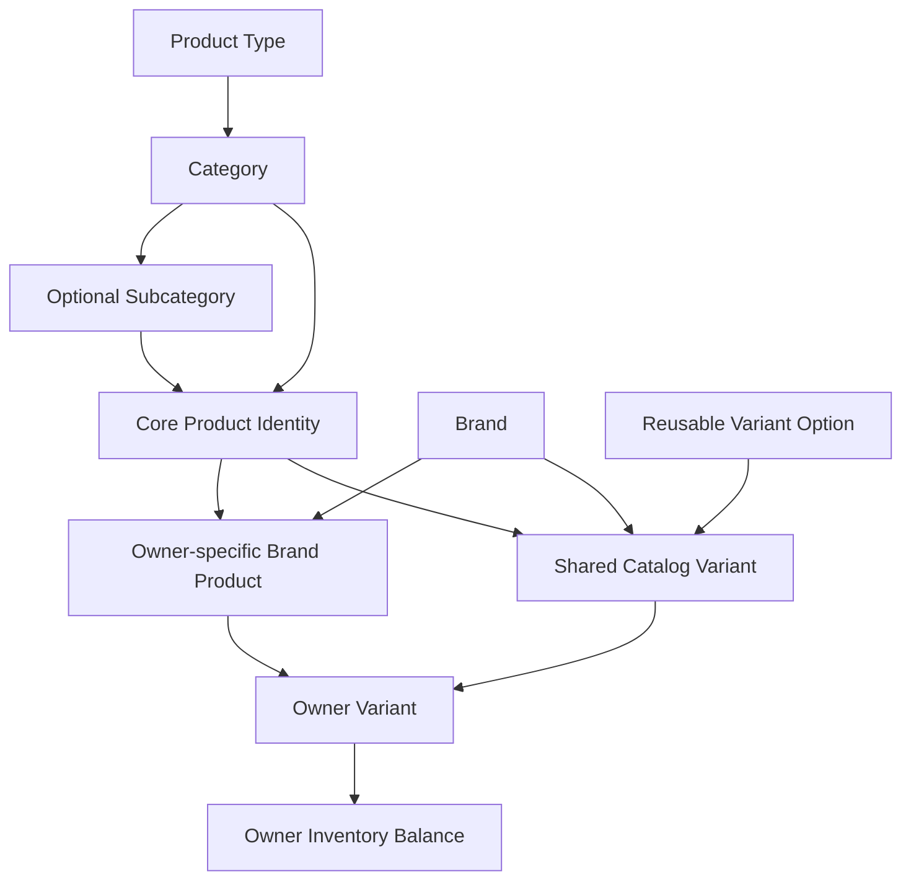
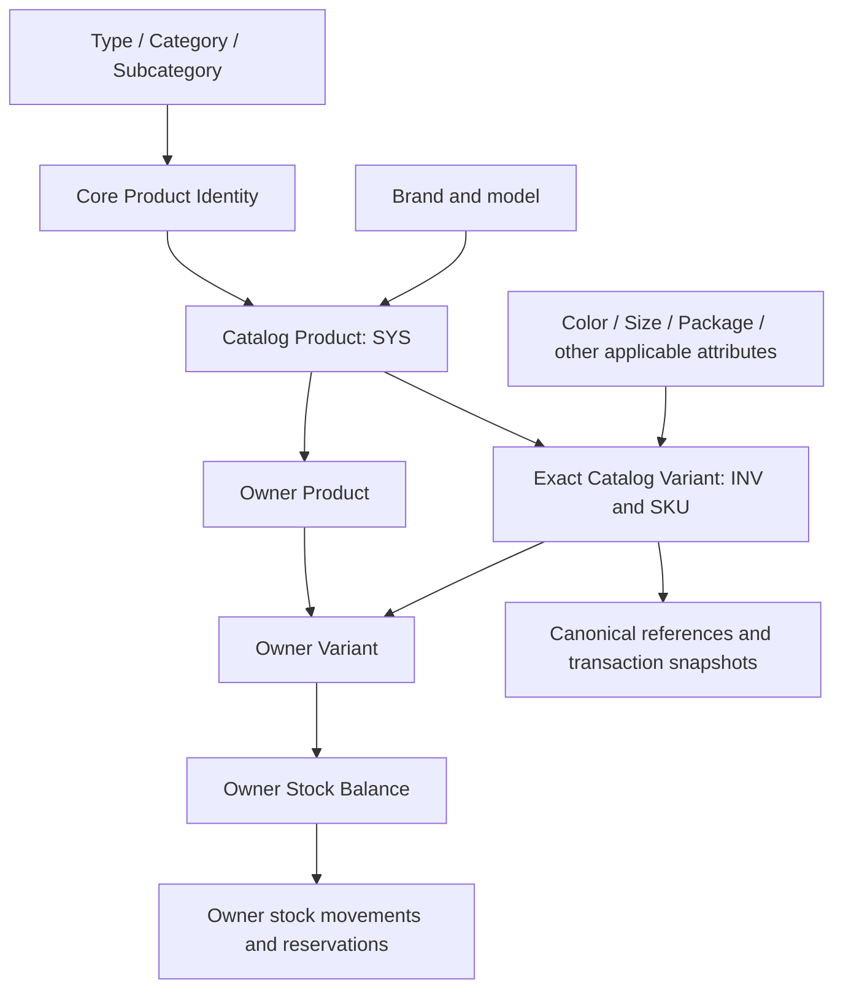

# Bikalpo Product Identification — Software Requirements

**Version:** 1.0, research draft for client review\
**Date:** 28 September 2026\
**Code baseline:** `51f05a07e9025d55e250b25d089cdbd3e7e4c1b4`\
**Scope:** English translation, current-system assessment, proposed domain model,
functional requirements, integration, migration, and acceptance criteria.

This document distinguishes **client-stated requirements**, **verified current
behavior**, and **recommended design decisions**. It does not claim that the new
ID system has been implemented. No application code, database schema, or business
data was changed during this research.

## 1. Recommended direction

Introduce three clearly separated business identifiers:

| Identifier | Recommended meaning | Example |
| --- | --- | --- |
| Product System ID | Permanent identity of one shared, actual branded product/model | `SYS-000000000001` |
| Product Inventory ID | Permanent identity of one exact stockable variant of that product, shared across sellers | `INV-030000000001` |
| SKU | Human-readable code of that exact variant, used in public presentation, search, sales, and purchase workflows | `APX-SHOE-BLK-42` |

The shared-product and shared-variant scopes are recommendations awaiting client
confirmation, not meanings proven by the examples. Keep each seller's listing,
prices, quantities, reservations, and stock history separate. Keep existing
integer database primary keys and foreign keys; the new business identifiers do
not need to replace them.

This requires more than adding prefixes. The essential changes are a clear
shared product identity, complete variant combinations such as **Color × Size**,
consistent SKU issuance, immutable Product Type, and integration across all stock
and transaction flows. Current `catalog_variant` and owner-scoped inventory are
useful foundations. [Current domain](../CONTEXT.md#L29),
[canonical variant](../packages/db/src/schema/catalog-variant.ts#L19),
[inventory balance](../packages/db/src/schema/inventory.ts#L27)

## 2. Client requirements translated into English

The source is the client's brief supplied in this conversation. This section
translates its meaning without adding implementation assumptions.

### 2.1 Product System ID

Example: **SYS-000000000001**.

- The system generates the ID when a product is created.
- It is the product's permanent identity.
- It identifies the main Product record in the database.
- After product creation, its **Product Type must never change**.

The last statement concerns Product Type, in addition to the permanence of the
identifier. Merely keeping the SYS text unchanged would not satisfy that rule.

### 2.2 Product Inventory ID

Example: **INV-030000000001**.

It identifies a specific stock-managed inventory item or variant associated
with Type, Category, Subcategory, Product, Variant, Color, and Size.

For the product **Sports Shoe**, with System ID **SYS-000000000001**:

| Inventory ID | Color | Size | Stock |
| --- | --- | --- | ---: |
| `INV-030000000001` | Black | 40 | 25 |
| `INV-030000000002` | Black | 41 | 18 |
| `INV-030000000003` | Black | 42 | 32 |
| `INV-030000000004` | White | 40 | 15 |

One product therefore has several independently identified and stocked variant
combinations. The brief does not specify a stock owner or whether “stock” means
on-hand versus available quantity. The implementation must use the existing
explicit quantity measures and owner context, not assume one platform balance.

### 2.3 SKU

Example: **APX-SHOE-BLK-42**.

The SKU is a human-readable product/inventory code. Visitors, customers,
retailers, wholesalers, salespeople, and warehouse staff can see it. It should be
easy to read, remember, speak, and search, and usable in sales and purchases.

The intended distinction is: **SKU for people; System ID for permanent product
identity; Inventory ID for stockable variant identity.** The brief does not say
that these strings must become relational database primary keys.

### 2.4 What the brief leaves unspecified

It does not define the meaning of `03`, the number allocation scope, whether all
listed hierarchy levels must be encoded into the digits, whether SYS or INV is
shared across sellers, or the uniqueness and editing rules for SKU. Those are
explicit decisions in Section 12; they must not be silently inferred.

## 3. Current implementation and gaps

### 3.1 Current entity chain

This is a relationship diagram, not a claim that all nodes are created in this
order. The catalog linker can create shared variants while owner variants are
being configured. [Linker](../packages/api/src/routers/helpers/sync-generated-variants.ts#L132)

| Current concept | What it actually does | Gap against the client requirement |
| --- | --- | --- |
| Product Type | Top-level classification with numeric PK, two-character `skuCode`, inventory behavior, and fulfillment family. | No complete invariant prevents an existing product's effective Type changing through ancestor edits. [Schema](../packages/db/src/schema/product-type.ts#L42) |
| Category / Subcategory | Classifies products; category points to Type, subcategory to category. Codes are scoped classification components. | A category can move to another active Type; this can indirectly change product Type. [Category update](../packages/api/src/routers/category.ts#L240) |
| Core Product Identity | Shared brand-neutral root, defaults, taxonomy, and brand creation mode. | It is not the actual owner-specific branded Product and must not accidentally be presented as one. [Domain](../CONTEXT.md#L29), [schema](../packages/db/src/schema/core-product.ts#L42) |
| Actual Product / Brand Product | A `product` row for a core and brand in Admin, Warehouse, or Shop scope. Equivalent goods can have several owner records. | No shared branded-product-level SYS entity exists. Putting SYS on this row would give each owner a different SYS. [Product ownership and uniqueness](../packages/db/src/schema/product.ts#L174) |
| Variant Option | Reusable structured measurement, loose unit, or a single attribute/value choice. | One attribute/value cannot express an arbitrary Color × Size combination. [Definition union](../packages/db/src/variant-definition.ts#L1) |
| Catalog Variant | Canonical core + brand + variant-option identity; integer PK and `BKV-` plus ten-digit `globalSku`. | Color is absent from its identity key; there is no complete multi-axis identity or client-format INV. [Schema](../packages/db/src/schema/catalog-variant.ts#L24) |
| Owner Variant | Local product variant with prices, SKU, optional free-text color/size, and canonical link. | Free-text fields do not make color/size part of shared identity; some legacy rows lack canonical links. [Schema](../packages/db/src/schema/product-variant.ts#L72) |
| Inventory | Independent stock balance for owner type + owner ID + owner variant. | Its numeric `inventoryId` is a balance key, not automatically the client's variant-level Inventory ID. [Schema](../packages/db/src/schema/inventory.ts#L30) |
| SKU generation | Multiple formats: legacy slug-based codes, `CP-...`, `SHOP-...`, `WH-...`, BKV, and a 15-digit classification helper. | No single platform-wide readable SKU contract. The classification allocator uses `MAX + 1`; it must not generate new permanent IDs. [Generators](../packages/api/src/routers/helpers/generate-sku.ts#L1), [generated variants](../packages/api/src/routers/helpers/sync-generated-variants.ts#L207) |

The code's **Core Product Identity** is the “core identity” concept considered
in this assessment; it is distinct from an identifier string or SKU.

### 3.2 Creation and handling paths that already exist

1. Admin configures Type, Category, optional Subcategory, Core Identity, brands,
   and reusable Variant Options.
2. Admin product creation validates selected brands/options and generates one
   actual Brand Product per selected brand, with reference-price rows and owner
   variants. Single/batch brand creation controls this workflow.
3. Warehouse and Shop configurations maintain their own brand products,
   variants, prices, and stock. They can use approved catalog identities and
   submit requests for missing setup entities.
4. Generated variants are linked to a shared Catalog Variant. B2B receiving can
   also create the buyer's corresponding owner product/variant/inventory.
5. Sales, Open Orders, purchases, returns, conversions, and stock movements use
   canonical and owner-specific references for different purposes.

Evidence and detailed entry points:
[creation-flow audit](./research/product-id-creation-audit.md),
[storage and consumer audit](./research/product-id-storage-audit.md),
[Admin create](../packages/api/src/routers/product.ts#L274),
[buyer-target handling](../packages/api/src/routers/helpers/b2b-buyer-target.ts#L168).

### 3.3 Critical behavioral gaps

- **Color/size identity:** The linker matches core + brand + option. Two colors
  using one size option can resolve to the same canonical identity. On a fully
  migrated database, the active product/catalog unique index can reject those
  two variants within one owner product; across different products, the
  color-blind equivalence remains a risk. This is not evidence that all current
  stock has already been merged incorrectly.
  [Linker](../packages/api/src/routers/helpers/sync-generated-variants.ts#L144),
  [active identity constraint](../packages/db/src/migrations/0037_global_catalog_variant_foundation.sql#L112)
- **Type permanence:** Core-managed Admin edits preserve several identity
  fields, but category/core/subcategory changes and legacy paths do not provide
  a comprehensive immutable-Type boundary.
  [Admin product update](../packages/api/src/routers/product.ts#L818),
  [core update](../packages/api/src/routers/admin-core-product.ts#L436),
  [subcategory update](../packages/api/src/routers/admin-subcategory.ts#L265)
- **Historical identity:** Some legacy update paths delete/recreate variants,
  and an explicit force-delete path removes dependent transaction lines.
  These behaviors must not be available for identities retained under the new
  permanent-ID contract. [Legacy update and delete](../packages/api/src/routers/product.ts#L899)
- **Identifier field lengths:** BKV and `global_sku_snapshot` are 14 characters;
  client SYS/INV examples are 16 characters including their prefixes. A prefix
  substitution without schema/API compatibility work is insufficient.
  [Catalog field](../packages/db/src/schema/catalog-variant.ts#L29),
  [order snapshots](../packages/db/src/schema/order.ts#L355)

### 3.4 Development-data evidence

A bounded read-only audit found **28 product rows, 63 owner variants, 30 shared
catalog variants, and 35 stock-balance rows**. Four stock rows reference variants
without shared catalog identity. No owner variant currently has a populated
color, so the footwear case needs an explicit test fixture.

The current Type codes are Grocery `01`, Gas `02`, Fashion `03`, Electronics
`05`, and Footwear `06`. Therefore the client's shoe example cannot be assumed
to use the existing Footwear code. Raw size differences across owners include
`NULL` versus a cylinder's numeric size; these must be normalized before any
split/merge decision. [Audit method, queries, and results](./research/product-id-development-data-audit.md)

## 4. Proposed domain model

These definitions are proposed for this feature. They do not silently replace
the repository's existing glossary while the entity-scope decision is pending.

| Proposed term | Definition |
| --- | --- |
| Catalog Product | One shared actual branded product/model. It owns SYS and a fixed Product Type. It can be listed by many owners. |
| Core Product Identity | Reusable classification/default root; retained separately from Catalog Product. |
| Catalog Variant / Inventory Item | One exact stockable combination of a Catalog Product's applicable attributes and package presentation. It owns INV and the canonical readable SKU. |
| Owner Product | Existing owner-specific Brand Product/listing referencing a Catalog Product, with independent commercial configuration. |
| Owner Variant | Existing local representation of a Catalog Variant, retaining the owner-specific prices and operational settings permitted today. |
| Inventory Balance | A particular owner's quantities and reservations for an Owner Variant. It has its own internal key and is not the shared INV identity. |

The same Apex Black/40 shoe held by a warehouse and retailer shares SYS, INV,
and canonical SKU in this proposal. Their stock balances, purchasing costs,
selling prices, and permissions remain independent. Twenty-five pairs share one
INV; per-unit serial numbers, cartons, and batches remain separate traceability
concepts. This separation is consistent with the existing Bikalpo model and
commerce precedent. [Shopify InventoryItem](https://shopify.dev/docs/api/admin-graphql/latest/objects/InventoryItem),
[InventoryLevel](https://shopify.dev/docs/api/admin-graphql/latest/objects/InventoryLevel),
[GS1 traceability levels](https://ref.gs1.org/standards/global-traceability/)

### 4.1 Where SYS could alternatively go

| Choice | Benefit | Consequence |
| --- | --- | --- |
| Existing Core Identity | Small change; shared across owners | One SYS covers multiple brands, so it identifies a generic root rather than one branded product. |
| Existing `product` row | Directly identifies today's main product record | Equivalent warehouse/shop/Admin listings have different SYS codes. Valid if the client explicitly wants record-level identity. |
| New Catalog Product — recommended | One platform identity for actual branded merchandise across owners | Adds a shared product aggregate and migration links; current owner products remain separate. |

The recommendation is a deliberate domain extension, not a claim that the
client explicitly requested a new table. If record-level SYS is selected, the
SYS allocation target changes; exact variants and owner stock separation remain
mandatory.

## 5. Identifier contracts

### 5.1 Product System ID

- **Format:** `SYS-` plus exactly 12 decimal digits; 16-character string.
- **Validation:** `^SYS-[0-9]{12}$`; numeric suffix from 1 to 999999999999.
- **Scope:** platform-wide uniqueness on Catalog Product, subject to Section 12.
- **Issuance:** once, during first successful persistence of that product,
  including a saved draft. Selecting an existing shared product reuses its SYS.
- **Permanence:** never editable, recomputed from a name, or reused after archive.
  Changes to price, description, image, visibility, or stock do not change it.
- **Access:** read-only in API/UI; clients cannot submit or overwrite issued IDs.

### 5.2 Product Inventory ID

Two formats fit the supplied twelve-digit example. The prefix meaning is not
yet confirmed; the implementation must select one contract before issuance.

| Option | Format after `INV-` | Allocation |
| --- | --- | --- |
| A: Opaque identifier — default recommendation if `03` has no defined meaning | 12-digit global sequence | One bounded global database sequence |
| B: Type-prefixed identifier — use if confirmed by client | Immutable 2-digit Type code + 10-digit sequence | A locked counter per Type or equivalent atomic allocation |

Both have exact validation `^INV-[0-9]{12}$`, are stored/serialized as strings,
and identify one exact shared variant in the recommended model. Option B reserves
Type codes `01`–`99` and sequence values 1–9999999999 within each Type. These
capacity limits are proposed contracts, not requirements stated in the brief.

Do not concatenate Category, Subcategory, Product, Variant, Color, and Size into
twelve digits. Store those as relationships and normalized attributes. A fixed
Type prefix can be supported because the client explicitly forbids Type changes;
other mutable taxonomy labels should not force new identity strings.
This follows the useful design principle of separating identification from
mutable descriptive information. [GS1 non-significance principle](https://ref.gs1.org/architecture/principles/)

If `03` must mean Footwear, agree a complete Type-code mapping before migration:
the current `03` already belongs to Fashion. Changing that mapping must preserve
old classification codes as historical lookup data, not rewrite prior documents.

### 5.3 Readable SKU

Recommended contract:

- One canonical SKU per exact Catalog Variant, unique platform-wide after
  case normalization. Owner-specific historical/local codes are lookup aliases
  in an explicit owner scope, not another canonical identity.
- Uppercase ASCII letters, digits, and single hyphens; proposed length 3–64.
  Generic composition: a stable product/model token, an optional brand token,
  and an ordered list of selected variant-value tokens. For example,
  `BRAND-PRODUCT-VALUE1-VALUE2`. The variable list comes from saved attribute
  definitions, not a hardcoded pattern for each Type. See section 6.3.
- Use stable approved tokens, not the first characters of mutable display names.
  For example, `APX-RUN01-BLK-42` distinguishes a particular Apex model.
- `APX-SHOE-BLK-42` is valid if that product token is unambiguous. It cannot identify
  two different Apex shoe models. Duplicate SKU submissions return a conflict
  with a suggested alternative; they never silently attach to an unrelated item.
- Generate a suggestion when a variant is created; persist the accepted value.
  Do not recompute it on every read or automatically rename it when labels change.
  Authorized automatic creation/receiving paths reserve a valid generated SKU
  through the same service without a new approval gate. A stable product/model
  discriminator or deterministic suffix can resolve generated-code collisions;
  user-supplied duplicate codes remain validation conflicts.
- An authorized Admin can intentionally rename it with an audit entry and an
  old-code lookup mapping. Retired canonical SKUs cannot be reassigned to different
  goods while historical scans/searches are supported.
- A product-level code may be a grouping reference; a transaction must resolve
  to an exact variant SKU. Scanning SYS or a group code prompts variant selection.

SKU is separate from a manufacturer's GTIN/EAN/UPC and from the barcode symbol
that carries a value. Keep genuine manufacturer codes in their own field/mapping;
do not claim generated SYS/INV numbers are GS1 identifiers.
[SKU guidance](https://help.shopify.com/en/manual/products/details/sku),
[GS1 identifier/barcode distinction](https://support.gs1.org/support/solutions/articles/43000734124-what-is-the-difference-between-a-gs1-gtin-a-barcode-an-ean-and-a-upc-)

## 6. Functional requirements

“Shall” defines the proposed implementation contract. Entries labeled **Client**
come directly from the brief; other entries are requirements recommended to make
that behavior consistent across Bikalpo.

| ID | Requirement | Basis |
| --- | --- | --- |
| PRD-01 | The system shall issue and persist one permanent SYS at product creation. | Client |
| PRD-02 | The product's Type shall be fixed from first persistence. Direct edits, imports, core moves, category/subcategory reparenting, and maintenance writes shall not bypass this rule. | Client; enforcement derived |
| PRD-03 | Every Category/Subcategory/Core/Product relationship shall be internally consistent and belong to the product's fixed Type. A same-Type classification correction requires an audited operation and shall not change SYS/INV. | Recommended |
| PRD-04 | A different brand/model is a different Catalog Product. Cosmetic label corrections do not automatically mean a different identity. Model distinctions shall be explicit where core+brand alone is insufficient. | Recommended |
| VAR-01 | Each valid stockable combination shall have its own INV and stock association; Black/40 and White/40 must remain distinct. | Client |
| VAR-02 | The canonical key shall contain all identity-bearing dimensions, using normalized values and deterministic ordering, with database-enforced uniqueness. | Recommended |
| VAR-03 | Reordering selected attributes or resaving/retrying the same combination shall reuse the existing variant, not issue a second INV. | Recommended |
| VAR-04 | Changing a used variant from Black to White, EU 40 to EU 41, or 12 KG to 25 KG shall create a replacement identity. Display-name corrections shall preserve identity. | Recommended |
| VAR-05 | Color, size system, size value, material/model attributes where relevant, measurement, container, and pack quantity shall be modeled only where applicable. Grocery/LPG shall not require shoe-specific values. | Recommended |
| VAR-06 | Variant generation shall support a reviewed combination matrix with invalid combinations omitted. A change shall not automatically create every possible combination without review. | Recommended |
| VAR-07 | Reusable attribute profiles shall be configurable as catalog data at the Core Product/product-family level. Each Catalog Product shall select its applicable identity-bearing axes within the profile's constraints. Broad Types such as Electronics shall not prescribe one universal set of variant fields. | Recommended |
| VAR-08 | Fixed product specifications shall be distinct from variant-defining attributes. Only attributes that distinguish independently stocked goods shall form the variant combination; all identity-bearing values shall participate in its canonical key even when omitted from the readable SKU. | Recommended |
| SKU-01 | All named audience groups shall be able to see and search the readable SKU wherever the corresponding product is permitted to be visible. | Client; visibility preserved |
| SKU-02 | Sales/purchase selection shall resolve SKU or INV to one authorized exact variant and retain its identity on the transaction. | Client; exact resolution derived |
| SKU-03 | Ambiguous historical/local aliases shall return explicit choices or a conflict, never the first matching row. | Recommended |
| SKU-04 | A shared generator shall compose SKUs from stable product and attribute-value codes using saved inclusion/order rules. New families using supported attribute types shall be configurable without adding a per-Type generator. Missing optional pieces, attribute-less products, excessive length, and code collisions shall have explicit handling. | Recommended |
| STK-01 | Owner stock balances shall remain independent even when SYS/INV/SKU are shared. An identifier shall never establish owner authorization. | Recommended |
| STK-02 | Receipts, reservations, sales, returns, adjustments, transfers, and damage shall use the correct owner variant and balance; quantity and unit rules shall remain intact. | Recommended |
| STK-03 | Carton-to-pack and bulk-to-loose conversion shall reference explicit source and target variants and conversion ratios. Different stockable presentations have distinct INV identities. | Recommended |
| STK-04 | Every operational variant, including legacy variants, shall have a verified canonical identity at cutover. Unresolved stock shall remain preserved in an explicit review/quarantine state and shall not be used for new identity-dependent postings. | Recommended |
| LIFE-01 | Used products/variants shall be archived or superseded, not deleted/recreated to change identity. Re-enabling the same entity shall reuse its original IDs. | Recommended |
| LIFE-02 | A product created under the wrong Type shall be archived and replaced under the correct Type, with an audited replacement link; existing transaction history remains attached to the old identity. | Recommended correction policy |
| AUD-01 | Identity creation, intentional SKU renames, archive/replacement, classification corrections, and migration decisions shall record actor, timestamp, reason, and old/new references. | Recommended |
| API-01 | APIs shall return full IDs as strings, while retaining existing numeric entity keys. New business codes shall not change the type or meaning of existing `productId`, `variantId`, or `inventoryId`. | Recommended |

### 6.1 Database guarantees

- Use a bounded sequence for a global number, or a transactionally locked counter
  with atomic increment for a Type-scoped number. Never allocate through row
  count, `MAX + 1`, a random suffix, or a browser counter.
- Add `NOT NULL`, exact-format checks, and unique indexes independently of
  generation. Define null handling for optional brand/model/attribute values so
  duplicate unbranded or attribute-less variants cannot bypass uniqueness.
- Enforce immutable IDs and Type with application validation and database guards.
  Guards must cover parent reclassification and concurrent updates, not only the
  product form. Require restrictive deletion behavior for referenced identities.
- Allocate within the creation transaction, return only committed IDs, and use
  creation idempotency plus a business-identity unique constraint for retries.
- Accept numeric gaps after rollback; never recycle or reset issued numbers.
  Check capacity before padding. Exhaustion returns a controlled error; it must
  never truncate digits or cycle the sequence.

PostgreSQL sequences provide concurrent allocation but are not gapless, and
generated identity alone does not replace uniqueness constraints.
[Sequence behavior](https://www.postgresql.org/docs/current/functions-sequence.html),
[identity constraints](https://www.postgresql.org/docs/current/ddl-identity-columns.html)

### 6.2 SKU and combination ownership

Admin manages catalog definitions, approved attribute values, and canonical SKU
rules. Preserve the current ability of authorized owners to combine approved
brands with compatible approved Variant Options/attribute values independently
of the Admin preset. The common resolver automatically creates/reuses the shared
product and variant and reserves a valid SKU; it does not require Admin approval
for each new combination or routine receiving operation.

Requests for new definitions, brands, or attribute values follow the existing
catalog approval policy, extended only where the new attribute model requires
it. Pending requests do not mint a competing approved product identity. Owners
retain their own prices and stock; permission to configure combinations does not
grant permission to rename another shared entity's canonical SKU.
The existing independent-configuration boundary is documented in the
[domain glossary](../CONTEXT.md#L33).

Names are not uniqueness keys. Size values must distinguish systems such as EU
40 versus another sizing standard. Attribute order and label capitalization must
not create different combinations. A package definition and a duplicated legacy
`size` string must not be counted twice in the identity key.

### 6.3 Dynamic attribute profiles and SKU generation

The system must not assume that all Electronics have capacity, speed, or pack
quantity. Type, Category, and Subcategory organize products; their number and
names do not determine the SKU format. A Phone and a Microphone can share a Type
while using different stock-defining attributes.

Store reusable attribute definitions as catalog data. Each definition needs a
stable key, display label, supported value type, validation rules, and, where
applicable, approved values with stable short codes and normalized units.
Core Product/product-family profiles reference those definitions and specify
which attributes are required, optional, or fixed specifications. A Catalog
Product selects its applicable variant axes and SKU inclusion/order rules from
that profile. This configuration is shared with its owner listings, rather than
being independently redefined by each warehouse or shop.

For example, the following fictional products all belong to Electronics. `ACM`
is an example brand token; the product and value codes below are configured or
allocated data, not built-in names or mandatory abbreviations.

| Catalog Product | Selected variant axes | Selected values | Generated example SKU |
| --- | --- | --- | --- |
| Phone PH01 | Color, Storage | Black, 128 GB | `ACM-PH01-BLK-128G` |
| Speaker SP01 | Color | Black | `ACM-SP01-BLK` |
| Microphone MC01 | Connector | USB | `ACM-MC01-USB` |
| Cable CB01 | Length, Connector | 2 metres, USB-C | `ACM-CB01-2M-USBC` |

A fixed speaker wattage can remain a specification without creating another
axis. A different speaker product may need both Color and Pack Quantity. The
profile offers reusable defaults; it does not force unrelated attributes onto
every product. A required value cannot be silently omitted to produce a code.

The common creation/resolution service shall:

1. Load the Catalog Product's configured axes and stable product/brand codes.
   Product tokens may be explicitly assigned approved model codes or allocated
   short codes; the service shall not infer identity from a display name.
2. Validate the submitted combination, normalize units/values, and resolve its
   complete canonical key using stable attribute/value identities. Reordered
   input and repeat submissions resolve to the same existing variant.
3. For a new combination, issue INV through the agreed allocator and assemble
   the readable SKU from configured tokens in saved order. Do not enumerate all
   possible combinations merely because a new attribute value was added.
4. Reserve the code with database-enforced uniqueness in the same transaction.
   If readable components collide or exceed the length limit, use a stable
   allocated variant discriminator with a bounded product token. Do not silently
   truncate identity-bearing input or assume abbreviations guarantee uniqueness.
   Explicitly submitted duplicate SKUs remain conflicts rather than being renamed.
5. Persist the accepted SKU and the configuration version used to issue it.
   A product with no variant axes has one default stockable variant and may use
   `PRODUCT-STD`; it still receives its own INV and SKU.

An authorized catalog manager configures a new family/profile as data. The
existing approval rules govern new definitions and values; combinations of
already-approved compatible values still use automatic issuance without a new
Admin approval step. The form renders the configured fields using supported
input types. Genuinely new data types or business operations may need code,
but adding another category or another ordinary attribute profile does not
require a new SKU-generation branch.

Version profiles and SKU rules. Changing labels or display order shall not
silently rename existing SKUs or split canonical identities. Adding or removing
identity-bearing axes on an existing product requires an explicit compatibility,
migration, or replacement operation; a new profile version alone does not create
a second variant for the same goods. Historical documents retain issued values.

The current `VariantDefinition` attribute branch holds only one attribute/value
pair. Implementing this design therefore requires the multi-attribute model and
combination resolver described here, not just a change to SKU concatenation.

## 7. Proposed schema and service changes

This is a logical implementation plan, not executable migration SQL.

| Area | Proposed change |
| --- | --- |
| New `catalog_product` | Retain an internal numeric PK; add `system_id` (unique, 16 characters), immutable `product_type_id`, `core_product_id`, `brand_id`, optional explicit model identity, status, audit timestamps. Define canonical product uniqueness with deliberate handling of unbranded/default-model values. |
| Existing `product` | Add `catalog_product_id`; retain existing product PK, creator scope, owner details/prices, and lineage. Enforce one Owner Product per Catalog Product in each owner scope, with one shared Admin scope rather than one per Admin user. Adjust current owner/core/brand uniqueness if multiple distinct models under that combination become supported. |
| Existing `catalog_variant` | Add `catalog_product_id`, `inventory_code` (unique, 16 characters), `sku` plus normalized unique key, and an exact combination definition/signature. Replace color-blind uniqueness only after reviewed backfill. Retain BKV as legacy identity during compatibility. |
| Attributes | Introduce reusable attribute/value definitions and variant-value associations or an equivalently constrained structured model. Enforce one value per axis and unique normalized combinations. Preserve structured measurement/loose/package definitions and type-scoped compatibility. |
| Attribute profiles and SKU rules | Add versioned Core Product/product-family profiles and shared Catalog Product axis selections. Store required/optional/specification roles, value validation, stable tokens, and SKU inclusion/order rules. Record the issuance configuration version without making that version an extra physical-variant identity dimension. |
| Existing `product_variant` | Retain PK and owner link. Require valid canonical identity for every operational variant, including legacy rows. Enforce that its Catalog Variant belongs to the same Catalog Product as its parent Owner Product. Preserve one operational Owner Variant per exact canonical variant in that owner scope; reactivate rather than duplicate it. Treat local color/size as projections/compatibility data. Synchronizers compare complete canonical combinations. |
| Reference-price/configuration rows | Key selections and prices by exact variant/combination, not only `variantOptionId`, so colors sharing a size may have independent prices. Preserve brand-specific Admin reference prices. |
| Existing `inventory` | Retain owner/variant uniqueness and balances. Join INV through the canonical variant. Do not relabel its numeric PK as the new shared Inventory ID. |
| Identifier lookup mappings | Record retired BKV/SKU codes, identifier kind, exact target, and owner scope where applicable. Globally unique historical codes cannot be reassigned; legacy ambiguous codes require scoped resolution. |
| Transaction snapshots | Add explicit SYS/INV/readable-SKU snapshot fields where needed; retain numeric references and existing historical BKV/local SKU snapshots. Use adequate lengths before new writes. |

Foreign keys to independently valid Product and Variant rows do not by themselves
prove that the rows belong together. Enforce the owner-to-canonical parent
invariant with appropriate composite constraints or database guards, alongside
the current inventory-owner guard. Keep these constraints represented in both
migrations and the maintained schema, and exercise them under concurrent creation.

Centralize these responsibilities in shared identity services used by Admin,
Warehouse, Shop, approval, receiving, and automatic buyer-target creation:

1. Validate taxonomy and a product's immutable identity.
2. Create or resolve the shared product and issue SYS once.
3. Normalize, create or resolve an exact variant and issue INV once.
4. Suggest/validate/reserve its readable SKU.
5. Resolve an exact identifier to an entity, then to an authorized owner listing
   and stock record in the operation's context.

This avoids separate generators drifting across roles. Identity issuance should
not be embedded independently in each form, stock page, or purchase handler.

## 8. API, UI, and workflow integration

### 8.1 Explicit API vocabulary

Recommended fields:

| Field | Meaning |
| --- | --- |
| `productId` | Existing numeric owner Product key; keep its contract |
| `catalogProductId` | Numeric shared Product key, if the recommended model is adopted |
| `systemId` | Full `SYS-...` string |
| `variantId` | Existing numeric Owner Variant key |
| `catalogVariantId` | Numeric shared variant key |
| `inventoryCode` | Full `INV-...` string, presented as “Inventory ID” |
| `inventoryId` | Existing numeric owner stock-balance key; keep its contract |
| `sku` / `canonicalSku` | Exact readable variant SKU; introduce an explicit new field where an existing `sku` already means owner-local SKU |

Do not silently return INV in `globalSku` while some clients still expect BKV,
or replace a numeric `inventoryId` with a string. Introduce/version the new fields,
update consumers, and deprecate legacy display fields deliberately.

### 8.2 Required integration surfaces

| Surface | Required behavior |
| --- | --- |
| Setup and approval | Validate Type/category consistency; manage stable code mapping and normalized attributes; apply permanent-Type guards to parent edits. |
| Admin product creation/editing | Issue/reuse shared SYS; show a combination matrix; issue INV and SKU only for selected valid variants; retain single/batch brand workflow. |
| Warehouse and Shop configuration | Reuse shared identities for equivalent goods; save all required attributes, including color; keep owner commercial details separate. |
| Admin catalog and product-price page | Display SYS as the product identifier and INV/SKU in expanded variant details; search all supported exact IDs. Update the current eight-digit product display deliberately. Preserve existing page styling and price behavior. |
| Public product views | Show readable SKU for the selected variant; require variant selection before identifying an exact purchasable item. Do not expose private owners' quantities or costs because an ID is known. |
| POS, sales, estimates, invoices | Resolve exact SKU/INV in owner scope; snapshot identifiers when posting; preserve historical printed meaning. |
| Manual purchase and receiving | Resolve to buyer-owned stock; automatic owner-product creation uses shared issuance; repeated receiving reuses INV. |
| B2B and Open Orders | Match complete shared variant identity; preserve source/target identities through receiving, substitution rules, offers, and conversions. |
| Returns, damage, adjustments, stock movements | Use original transaction references and the correct owner stock; preserve identity after archive or SKU rename. |
| Search, barcode scans, labels, imports | Support SYS, INV, canonical SKU, recognized old codes, and manufacturer barcodes through one consistent resolver. Preserve bulk APIs still used elsewhere, without restoring removed pricing-page upload/export controls. |
| Web, native app, cached carts, persisted drafts | Migrate changed response contracts and exact selection keys together; stale selections must be revalidated before posting. |

Source map for these dependencies:
[storage and transaction audit](./research/product-id-storage-audit.md#consumers-that-must-be-migrated-together).

### 8.3 Display and lookup rules

- Labels must distinguish **Product System ID**, **Inventory ID**, and **SKU**.
  Do not use an unexplained “ID” for multiple different entities in the same view.
- Full SYS/INV must remain available to copy and search on desktop and mobile.
  Responsive wrapping, an accessible detail view, or copy control may provide
  space; a shortened suffix must not become the operational lookup key.
- Exact canonical ID/SKU matches precede broad text search. SYS resolves a product
  and its variants; INV resolves one variant; ambiguous aliases require context.
- Barcode artwork may encode an internal string where supported, but a printed
  barcode does not turn that string into a GS1 GTIN.
- `INV-` already appears in invoices and invitation codes. Route lookup by full
  validated format **and entity/operation context**, not `startsWith('INV-')`.
  [Invoice generator](../packages/api/src/routers/warehouse-pos.ts#L130),
  [invitation generator](../packages/api/src/routers/admin-invite-tracking.ts#L16)

## 9. Migration plan

Development status permits a deliberate model improvement. It does not require
discarding stock history or changing dozens of existing relational keys.

### Phase 0 — Confirm and freeze the contract

Resolve SYS scope and the INV prefix decision in Section 12. Record the approved
Type-code registry, SKU uniqueness/ownership, and exact variant key. Capture a
database backup and a migration manifest before mutation. Inventory every write
path and API/client version that creates or resolves products.

### Phase 1 — Audit and normalize

- Identify missing core/brand/option links, duplicate canonical combinations,
  owner/type mismatches, ambiguous SKU codes, and incomplete variant definitions.
- Normalize from structured option definitions first. Review free-text color,
  size, and model information without inferring equality from product names.
- Place unresolved rows in an explicit review queue. The observed four stocked
  variants without catalog linkage cannot simply disappear or be force-matched.
  Reconcile them before enabling normal operations under the new contract, or
  explicitly quarantine them from new sales/receipts/transfers/conversions until
  resolved. Keep quantities and history visible to authorized reviewers; an old
  return requiring an ambiguous target goes to review rather than guessed stock.
- If one old canonical variant represents several genuinely different attribute
  combinations, create an explicit split plan. Recover each owner variant and
  transaction's intended item from reliable historical data; ambiguous history
  must remain flagged rather than rewritten by guesswork.

### Phase 2 — Add shared product and complete variant identity

Add tables/columns and mappings without dropping existing keys. Link only
verified equivalent owner products to one Catalog Product. Extend configuration,
price rows, variant signatures, canonical linking, and constraints together.
Retain all original numeric IDs where their meaning remains correct.

### Phase 3 — Allocate and backfill identifiers

Issue SYS and INV in deterministic migration order using the approved allocator;
persist an old-to-new mapping so rerunning resumes instead of reminting codes.
Generate readable SKU candidates, resolve collisions, and then enforce required
uniqueness/non-null constraints for operational records. Preserve legacy BKV and
local SKU mappings and original transaction snapshots.

### Phase 4 — Switch creation and consumers

Deploy shared issuance and compatibility reads across all roles. During a staged
rollout, dual-write required old and new snapshot fields until old readers have
been retired. Never place a 16-character INV into the existing 14-character BKV
field. Update API clients, pricing/catalog UI, POS, purchase/return, matching,
labels, search, and imports as one coordinated release.

A brief controlled maintenance cutover may be simpler in development; if chosen,
stop writes while final backfill and reconciliation run. Do not mix old writers
with newly enforced identity constraints.

### Phase 5 — Reconcile and enforce

Compare pre/post counts and mappings for every product/variant; compare stock
quantities, reservations, carton/loose balances, valuation inputs, and transaction
references per owner and variant. Verify conversions and returns still resolve
their original source/target identities. Enable database immutability/deletion
guards, exact lookup indexes, and all acceptance tests before completion.

### Rollback and correction

Before new IDs are exposed, a failed backfill can be rolled back using the backup
and migration manifest. Once an ID has appeared on labels or transactions, it
must not be recycled even if a release is rolled back. Keep issued values and
compatibility mappings, roll back application behavior safely, and use a forward
repair for erroneous mappings. A destructive development reset is a separate
operation requiring a stated disposable dataset; it is not part of this research.

## 10. Acceptance criteria

| Test | Required result |
| --- | --- |
| AC-01: Create product | A persisted product receives exactly one SYS matching the format; repeated read/edit never changes it. |
| AC-02: Client footwear example | Black/40, Black/41, Black/42, White/40 have four distinct INV/SKU values and quantities 25/18/32/15 for the chosen owner. Size system and stock unit are explicit. |
| AC-03: Same variant, another owner | Under the recommended shared model, SYS/INV/SKU are reused; owner stock keys differ, and changing one owner's stock does not affect the other. |
| AC-04: Color distinction | Black/40 and White/40 can both be created under one product, carry different prices/stock, and never substitute for each other during order matching or receipt. |
| AC-05: Multiple models/brands | Same shoe size/color under different brand or model gets the correct distinct product/variant identity; duplicate human SKU is rejected. |
| AC-06: Concurrent/retried creation | Parallel creates issue no duplicate codes or canonical tuples. Repeated idempotency key returns the original entity. Rollback gaps are accepted. |
| AC-07: Type permanence | Direct API changes, category/core/subcategory reparenting, imports, and direct maintenance updates cannot change an existing product's Type. Concurrent reparent/create is also covered. |
| AC-08: Normalization | Attribute order/case changes and redundant legacy size projections do not create duplicate variants; EU and other size systems remain distinct. |
| AC-09: Archive and replacement | Reactivation keeps IDs; a structural replacement receives new IDs and an audit link; old transactions still resolve. |
| AC-10: Receiving/sale/return | Partial receipts, reservations, sale, damage, return, and void affect the intended owner's exact variant and preserve existing quantity rules. |
| AC-11: Conversion | Carton/pack or bulk/loose conversion uses distinct correct INV source/target values and conserves quantities according to the recorded ratio. |
| AC-12: Search and scanning | SYS, INV, readable SKU, supported old BKV/local codes, and manufacturer codes resolve consistently. Ambiguous aliases require selection; invoice/invite INV strings are not inventory matches. |
| AC-13: Historical documents | Existing BKV/local SKU snapshots remain as issued; new documents record full SYS/INV/SKU without truncation. SKU rename does not rewrite history. |
| AC-14: Desktop/mobile/access | Relevant roles can see/search SKU, full IDs remain accessible, and knowing an ID does not permit unauthorized stock or price access. |
| AC-15: Migration repeatability | Re-running the migration mints no replacement IDs, duplicates no stock, and preserves all reconciled owner quantities and transaction relationships. |
| AC-16: Capacity and invalid input | Overflow, malformed ID, forged client-issued ID, invalid attribute combination, and duplicate canonical SKU produce controlled validation/conflict errors. |
| AC-17: All creation paths | Admin single/batch, Warehouse, Shop, approved requests, imports where present, and automatic buyer creation all use the same identity contract. |
| AC-18: Owner/canonical integrity | Linking an Owner Variant to another Catalog Product's variant fails. Concurrent configuration of the same owner/catalog product/variant cannot create duplicate listings or stock balances; Admin scope is independent of the individual Admin actor. |
| AC-19: Legacy cutover | Every operational legacy stock row is mapped correctly or explicitly quarantined from new identity-dependent postings. Review status preserves quantities/history and cannot be bypassed through an older API. |
| AC-20: Dynamic product families | Phone, Speaker, Microphone, and Cable profiles under the same Electronics Type produce different applicable fields and SKUs through the same generator. Adding a family using supported attribute types requires catalog configuration rather than a per-family code branch. Required values are validated, fixed specifications do not create variants, and products without axes resolve to one default variant. |
| AC-21: Profile and SKU stability | Profile label/order changes preserve existing variant identities and issued SKUs. A structural axis change requires explicit migration/replacement handling. Excessive length or colliding readable tokens receive a stable allocated discriminator; every distinct canonical combination remains uniquely resolvable. |

The tests above are proposed acceptance tests. They have not been implemented
or reported as passing for this new feature. The current footwear gap is based
on code inspection, supported by schema/constraint and development-data checks.

## 11. Implementation work packages

1. **Domain and contract:** approve scope, Type registry, SKU rules, combination
   schema, and API vocabulary; update the shared glossary once agreed.
2. **Database and identity service:** shared Product aggregate, full variant key,
   allocators, uniqueness, immutability, legacy mappings, and backfill tooling.
3. **Creation/configuration:** Admin, Warehouse, Shop, approval, and buyer-target
   integration; variant matrix and exact reference-price rows.
4. **Operational integration:** purchasing, receiving, stock, conversions,
   marketplace/Open Orders, POS, returns, damage, and transaction snapshots.
5. **Presentation and lookup:** catalog/pricing/public views, search/scans,
   document/label output, web/native clients, and compatible legacy resolution.
6. **Cutover:** dry run, reconciliation, contract tests, controlled rollout,
   post-cutover verification, and removal of obsolete generators only after their
   consumers have migrated.

Do not estimate this as a simple ID-label change. Its main work is preserving
correct product/variant/owner identity throughout the transaction lifecycle.

## 12. Decision register

Two high-impact questions were raised during research. Until answered, the
following draft assumptions make the design concrete without misrepresenting
them as client-approved requirements.

| Decision | Draft recommendation | What changes if a different choice is made |
| --- | --- | --- |
| D-01: What receives SYS? | One shared actual branded product/model across owners. **Client confirmation pending.** | If each current Product record needs its own SYS, issue on `product` and omit the shared SYS aggregate; equivalent goods then have different SYS per owner. Core-root SYS is a third possible meaning and must be explicitly named. |
| D-02: Does `03` encode Type? | Do not infer it. Use opaque numbering if it is only an example; use a frozen 2+10 contract if confirmed. **Client confirmation pending.** | Type-prefixed issuance requires a code registry and resolution of current Fashion `03` versus Footwear `06`. |
| D-03: Does INV identify a variant or an owner's stock row? | One shared exact variant; separate owner balances. | Owner-specific INV remains possible but cannot replace shared catalog matching; schema and labels must distinguish it explicitly. |
| D-04: Who controls SKU uniqueness? | Platform-wide canonical SKU under Admin-managed rules; automatic issuance for authorized owner combinations; scoped legacy/local lookup aliases. | Owner-defined primary SKUs require owner-scoped uniqueness and explicit SKU context in cross-owner operations. |
| D-05: What distinguishes models? | Explicit model identity when core+brand is insufficient; no matching by name. | If each Core Identity is guaranteed to mean one exact model, core+brand can be sufficient and a separate model field may be unnecessary. |
| D-06: Wrong Type correction | Archive and create a replacement with lineage; never change the issued product's Type. | An in-place correction exception would contradict the literal client rule and needs an explicit revised requirement. |

These are design decisions to settle before implementation, not reasons to
discard the research or delay review of the concrete proposal.

## 13. Evidence and research notes

- [Current creation, editing, approval, and variant behavior](./research/product-id-creation-audit.md)
- [Identity storage, stock, and transaction consumers](./research/product-id-storage-audit.md)
- [Read-only development-data snapshot and reproducible queries](./research/product-id-development-data-audit.md)
- [Primary-source research: GS1, PostgreSQL, and commerce inventory models](./research/product-id-primary-sources.md)

External sources provide design evidence, not authority to invent requirements
for this client. The complete proposal remains conditional on the entity-scope
and ID-format decisions above. No changes were made to authentication user IDs,
the already-implemented editor-ID display, or live product handling.
