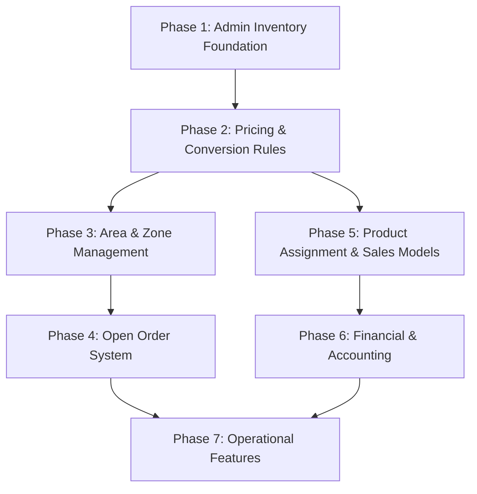

# Implementation Roadmap — Sequential Order

All 14 remaining features organized into 7 phases. Each phase completes before the next begins. Dependencies flow downward.

---

## Phase 1: Admin Inventory Foundation

> **Why first:** Everything else depends on correct stock tracking. The ledger, B2B conversion, and pricing all rely on the admin having proper variant-level inventory.

### Feature 1.1 — Admin Variant-Level Inventory

**Current:** Admin stock page uses flat `product.stockQuantity`. No `inventory` records with `ownerType = "super_seller"` exist.

**Backend:**
- [ ] Update `product.adjustStock` → create/update `inventory` record with `ownerType = "super_seller"` instead of modifying `product.stockQuantity`
- [ ] Write `stock_ledger` entry on every adjustment (IN / ADJUST)
- [ ] Ensure B2B conversion `convert_out` now finds the super_seller inventory

**Frontend:**
- [ ] Update admin Stock page to show per-variant inventory (not flat product stock)
- [ ] "Adjust Stock" dialog → select variant → adjust per-variant quantity
- [ ] Display variant SKU, type (TRADE/RETAIL), unit label in stock table

**Verification:**
- [ ] Admin adds 10 units of TRADE variant → `inventory` record created, `stock_in` ledger entry
- [ ] B2B order delivered → `convert_out` ledger entry appears for admin, `convert_in` for shop
- [ ] Ledger page shows both sides of the conversion

### Feature 1.2 — Pack Return & Deposit Configuration

**Current:** `product_pack_rules` schema exists but no UI/API.

**Backend:**
- [ ] CRUD API for `product_pack_rules` (admin sets default, shop can override)
- [ ] Deposit amount stored per product

**Frontend:**
- [ ] Product edit form → "Pack Return" section (returnable toggle, deposit amount, allowed brands/sizes)
- [ ] Consumer checkout → if returnable pack, show "Do you have old pack?" flow
- [ ] Deposit added to order total if no old pack

**Verification:**
- [ ] Product marked returnable → consumer sees pack section at checkout
- [ ] Deposit correctly added to order total

---

## Phase 2: Pricing & Conversion Rules

> **Why second:** Pricing controls ensure shops can't sell below cost. Conversion rules formalize the TRADE→RETAIL logic that's currently somewhat hard-coded.

### Feature 2.1 — Variant Conversion Rules Manager

**Current:** `variant_conversion_map` schema exists. Conversion ratio/loss are on `product_variant` but not managed via UI.

**Backend:**
- [ ] CRUD API for `variant_conversion_map` (admin only)
- [ ] B2B conversion reads from `variant_conversion_map` instead of variant fields

**Frontend:**
- [ ] Admin → "Conversion Rules" page under Catalog
- [ ] Table: From Variant → To Variant → Ratio → Loss% → Auto-convert toggle
- [ ] Edit/create conversion rules

**Verification:**
- [ ] Admin creates rule: 1 Sack → 50 KG Loose (ratio: 50, loss: 2%)
- [ ] B2B delivery triggers conversion using the rule, loss applied correctly

### Feature 2.2 — Pricing & Margin Control

**Current:** Shop can set any `retailPrice` in inventory. No validation against base price or margin rules.

**Backend:**
- [ ] Add `base_price`, `min_margin_percent` fields to `product_variant` (or new `pricing_rules` table)
- [ ] Validate shop price update: `shop_price ≥ base_price + (base_price × min_margin%)`
- [ ] Price deviation alerts (log when shop sets price outside recommended range)
- [ ] Shop price update logs (track history)

**Frontend:**
- [ ] Admin → product variant edit → set base price + min/max bands
- [ ] Shop pricing page → show validation errors if price too low
- [ ] Admin → "Price Changes" page (already has route, enhance it)
- [ ] Price deviation alert badges

**Verification:**
- [ ] Shop tries to set price below `base_price + margin` → error
- [ ] Valid price updates logged in history
- [ ] Admin sees all price changes across shops

---

## Phase 3: Area & Zone Management

> **Why third:** Area management is required before Open Orders can auto-route to nearest eligible shops. Also needed for delivery zone pricing.

### Feature 3 — Area & Zone System

**Current:** [area.ts](file:///c:/Users/Shorno/WebstormProjects/bikalpo-project/packages/db/src/schema/area.ts) schema exists but no CRUD, no polygon management, no shop-area assignment.

**Backend:**
- [ ] CRUD API for areas/zones (admin creates, assigns name + polygon/radius)
- [ ] Shop → area assignment (link shop to one or more areas)
- [ ] Consumer address → area matching (point-in-polygon or radius check)
- [ ] "Eligible shops for area" query

**Frontend:**
- [ ] Admin → "Areas & Zones" page with create/edit
- [ ] Map-based polygon drawing (or simple radius around coordinates)
- [ ] Shop profile → area assignment dropdown
- [ ] Consumer location picker → matched area display

**Verification:**
- [ ] Admin creates area "Dhaka Central" with polygon
- [ ] Shop assigned to "Dhaka Central"
- [ ] Consumer in Dhaka Central area → sees eligible shops

---

## Phase 4: Open Order System

> **Why fourth:** Depends on Area Management (shop matching) + Pricing (price validation) + Inventory (stock check). This is the most complex feature.

### Feature 4 — Open Order Flow

**Current:** B2C orders require consumer to select a specific shop. No auto-matching.

**Backend:**
- [ ] New order type: `open_order` (no `shopId` at creation)
- [ ] Order matching algorithm: find eligible shops by area → stock → price → OTP load
- [ ] Shop notification: "New open order available"
- [ ] Shop accept/reject endpoints with timer
- [ ] OTP load control (max 2 pending per seller)
- [ ] Auto-reassignment on rejection/timeout
- [ ] Negotiation timeout (configurable per variant)

**Frontend:**
- [ ] Consumer checkout → option to "Let us find the best shop" (no shop selection)
- [ ] Shop dashboard → "Incoming Orders" tab (already exists) → open order accept/reject UI
- [ ] Timer countdown on open orders
- [ ] Consumer side → order status shows "Finding a shop..." → "Shop found!"

**Verification:**
- [ ] Consumer places open order → system finds nearest eligible shop
- [ ] Shop accepts → order proceeds as normal B2C
- [ ] Shop rejects → auto-reassigns to next eligible shop
- [ ] Max 2 OTP per shop enforced

---

## Phase 5: Product Assignment & Sales Models

> **Why fifth:** These features control WHAT shops can sell. They depend on the inventory and pricing foundations from Phase 1-2.

### Feature 5.1 — Product-Shop Assignment

**Current:** All shops see all products. No permission filtering.

**Backend:**
- [ ] `product_shop_assignment` table (productId, shopId, status)
- [ ] Filter shop product queries by assignment
- [ ] Admin assign/unassign products to shops
- [ ] Shop product request → admin approval queue

**Frontend:**
- [ ] Admin → "Product Assignment" page (bulk assign products to shops)
- [ ] Shop dashboard → "Request Product" button
- [ ] Admin → "Product Request Queue" (approve/reject)
- [ ] Shop only sees assigned products in their catalog

**Verification:**
- [ ] Admin assigns 5 products to Shop A
- [ ] Shop A sees only those 5 products
- [ ] Shop A requests new product → admin approves → product appears

### Feature 5.2 — Sales Model System

**Current:** `sales_model` schema exists but unused.

**Backend:**
- [ ] CRUD API for sales models
- [ ] Model → product mapping (add/remove products from model)
- [ ] Shop → model assignment (shop inherits model's products)

**Frontend:**
- [ ] Admin → "Sales Models" page
- [ ] Create model → select products → assign to shops
- [ ] Model performance report (sales per model)

**Verification:**
- [ ] Admin creates "Grocery Essentials" model with 20 products
- [ ] Assigns model to Shop A → Shop A sees those 20 products
- [ ] Model updated → shop catalog auto-syncs

---

## Phase 6: Financial & Accounting

> **Why sixth:** Financial features are reporting/tracking layers on top of the operational data from Phases 1-5.

### Feature 6 — Financial Accounting Module

**Current:** Basic invoice system exists. No full accounting.

**Backend:**
- [ ] Accounts table (Cash, Bank, Revenue, Expense, etc.)
- [ ] Transactions table (double-entry: debit + credit)
- [ ] Expense categories + income categories
- [ ] Auto-create transactions from orders, returns, deliveries
- [ ] Balance sheet / trial balance / cash flow report queries

**Frontend:**
- [ ] Admin → "Financial Overview" dashboard
- [ ] Accounts list with balances
- [ ] Transaction history with filters
- [ ] Expense recording form
- [ ] Income recording form
- [ ] Report pages: Balance Sheet, Trial Balance, Cash Flow
- [ ] Credit note management (for returns)

**Verification:**
- [ ] B2B order creates revenue transaction automatically
- [ ] Admin records expense → balance sheet updated
- [ ] Reports calculate correctly

---

## Phase 7: Operational Features

> **Why last:** These are operational tools that enhance the platform but don't block core business flows.

### Feature 7.1 — Full Delivery Dashboard

**Current:** Basic delivery listing exists. No trip management or proof system.

**Backend:**
- [ ] Trip management (start trip → pickup → deliver per stop)
- [ ] Photo/proof upload per delivery
- [ ] Return pickup flow
- [ ] Route optimization endpoint

**Frontend:**
- [ ] Platform delivery man → trip view with stop list
- [ ] Shop delivery man → B2C delivery dashboard
- [ ] Photo upload at delivery
- [ ] Return collection interface

### Feature 7.2 — SR (Sales Rep) System

**Backend:**
- [ ] SR → area/territory assignment
- [ ] Visit tracking (check-in/check-out per shop)
- [ ] Order placement on behalf of shop
- [ ] SR daily report

**Frontend:**
- [ ] SR dashboard with route/visit map
- [ ] Visit log form (notes, photos, orders placed)
- [ ] Performance reports

### Feature 7.3 — Offers, Coupons & Promotions

**Backend:**
- [ ] Coupon CRUD (code, discount type, min order, validity)
- [ ] Offer rule engine (BxGy, flat %, amount off)
- [ ] Gift card system
- [ ] Apply coupon to order

**Frontend:**
- [ ] Admin → offers management
- [ ] Shop → offer toggle
- [ ] Consumer → apply coupon at checkout

### Feature 7.4 — SMS Marketing & Notifications

**Backend:**
- [ ] SMS gateway integration (e.g., Twilio, local BD gateway)
- [ ] SMS template system
- [ ] Auto SMS triggers (order status, delivery updates)
- [ ] Campaign builder

**Frontend:**
- [ ] Admin → SMS campaigns
- [ ] Template editor

### Feature 7.5 — HRM & Payroll

**Backend:**
- [ ] Employee CRUD with departments/designations
- [ ] Shift configuration
- [ ] Attendance tracking (check-in/out)
- [ ] Leave management

**Frontend:**
- [ ] Admin → Employee directory
- [ ] Shift management calendar
- [ ] Attendance log
- [ ] Leave application & approval

---

## Phase Summary

| Phase | Features | Est. Sessions | Dependencies |
|-------|----------|---------------|--------------|
| **Phase 1** | Admin Inventory + Pack Returns | 3-4 | None (foundation) |
| **Phase 2** | Conversion Rules + Pricing | 3-4 | Phase 1 |
| **Phase 3** | Area & Zone Management | 3-4 | None (parallel OK after P1) |
| **Phase 4** | Open Order System | 5-6 | Phase 2 + Phase 3 |
| **Phase 5** | Product Assignment + Sales Models | 3-4 | Phase 2 |
| **Phase 6** | Financial Accounting | 5-6 | Phase 5 |
| **Phase 7** | Delivery, SR, Offers, SMS, HRM | 8-10 | Phase 4 + Phase 6 |

**Total estimated: ~30-38 sessions**

> [!TIP]
> Phases 3 and 5 can run in parallel after Phase 2 completes, since they don't depend on each other.
